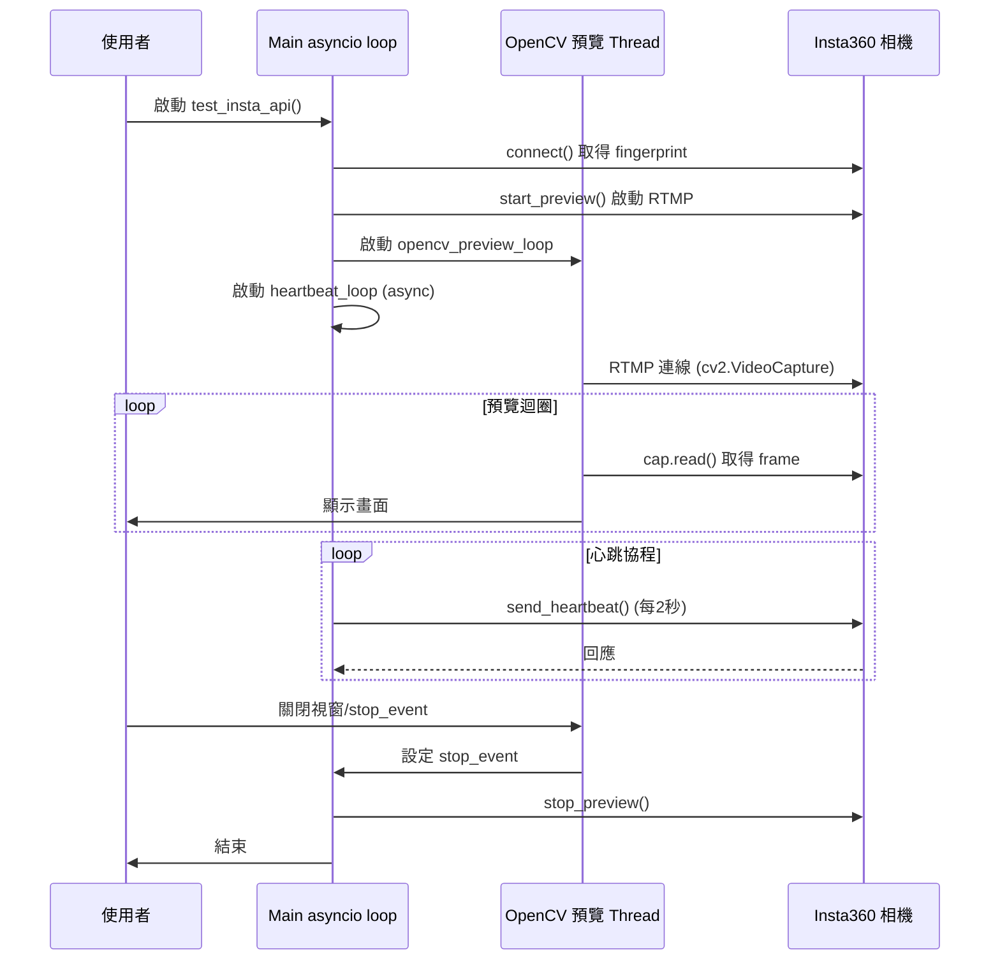

# Insta360 OpenCV 非同步預覽與心跳設計說明

## 背景與問題

在開發 Insta360 RTMP 串流即時預覽與控制時，常見需求是：
- 需要即時顯示相機畫面（高幀率預覽）。
- 同時維持與相機的 API 連線（如每秒心跳，避免 session 過期）。
- 兩者都要穩定、低延遲，且不互相干擾。

### 原本設計的問題

最初設計是在 asyncio 協程中直接用 while 迴圈呼叫 OpenCV 的 `cap.read()` 來抓取 RTMP 畫面，並用另一個 async task 執行心跳。這樣理論上應該能同時運作，但實際上會遇到：

- **OpenCV 的阻塞問題**：
  - `cv2.VideoCapture` 與 `cap.read()` 都是同步阻塞操作，會卡住 Python 的主執行緒。
  - 即使在 async function 裡呼叫，event loop 仍會被阻塞，導致其他協程（如心跳）無法及時執行。
  - 若 RTMP 串流有延遲、丟包，`cap.read()` 會卡住更久，嚴重時心跳會 timeout。

- **Windows 平台的 asyncio 限制**：
  - Windows 預設 event loop（ProactorEventLoop）對於高頻 socket 操作和同步 I/O 混用更敏感，容易出現 socket reset、event loop 崩潰等現象。

- **網路層的競爭**：
  - RTMP 串流與 HTTP API（心跳）同時搶佔 socket 資源，若有一方阻塞，另一方也會受影響。

## 目前的檔案架構

```
insta_cam_module/
    非同步設計說明.md
    insta_api_test.py
    main.py
    README.md
    config/
        api_payloads.json
        settings.json
    controller/
        insta_controller.py
    services/
        heartbeat.py
    ui/
        main_window.py
    utils/
        config_loader.py
        frame_receiver.py
        frame_splitter.py
```

- **insta_api_test.py**：測試主流程，負責啟動 RTMP 預覽與心跳。
- **controller/insta_controller.py**：與 Insta360 API 溝通的主控類別。
- **services/heartbeat.py**：心跳服務邏輯。
- **utils/**：設定、frame 處理等輔助模組。

## 非同步架構設計邏輯

為了解決上述問題，採用「協程 + 執行緒」混合設計：

1. **OpenCV RTMP 預覽移到獨立 Thread 執行**
   - 用 `threading.Thread` 執行 while 迴圈抓取 RTMP 畫面，負責即時顯示。
   - 這樣 OpenCV 的同步阻塞操作只會卡住 thread，不會影響主 asyncio event loop。
   - 預覽 thread 可用 `threading.Event` 控制結束時機。

2. **心跳 loop 保持在 asyncio 協程**
   - 主 asyncio event loop 專心跑 async 任務（如心跳、API 控制），不再被 OpenCV 阻塞。
   - 心跳協程每2秒發送一次 HTTP 請求，確保 session 不會中斷。
   - 用 `threading.Event` 檢查預覽 thread 是否結束，協調流程。

3. **兩者協調結束**
   - 預覽 thread 結束時（如視窗關閉、RTMP 中斷），設置 event，心跳 loop 也會結束。
   - 結束時再呼叫 stop_preview，確保資源釋放。

## 詳細流程圖

1. 啟動主程式（asyncio）
2. 啟動 OpenCV 預覽 thread（同步 while 迴圈）
3. 啟動心跳 async 協程（每2秒發送一次）
4. 預覽 thread 偵測到結束（如視窗關閉）→ 設置 event
5. 心跳 loop 偵測到 event → 結束
6. 主程式收尾，釋放資源

## Mermaid 訊號流程圖



## 目前遇到的問題與推測成因

- 即使已經將 OpenCV 預覽與心跳分離（thread + async），仍會出現 Windows 下的 `ConnectionResetError: [WinError 10054]`。
- 此錯誤平均每10秒發生一次，推測是 RTMP 與 HTTP 請求在 socket 層競爭，或 OpenCV 抓 frame 頻率與 RTMP 實際推送不同步，導致底層 socket 狀態異常。
- 強行指定抓取頻率（如每秒20張）可能會讓 OpenCV 與 RTMP 串流產生「節奏不一致」，進而造成 socket reset。
- 若不 sleep，讓 OpenCV 盡量快地抓取 frame，雖然能減少部分異常，但仍有機會遇到 Windows 下的 socket 管理問題。
- 這可能是 Python + OpenCV + asyncio + RTMP 在 Windows 下的架構性限制。

## 小結

目前已經盡量將同步與非同步分離，並嘗試多種 sleep、頻率調整方式，但仍有底層 socket reset 問題。推測為 Windows 下多通道 socket 管理與 RTMP/HTTP 協議競爭所致，建議可與其他 AI 或專家進一步討論底層解法。
