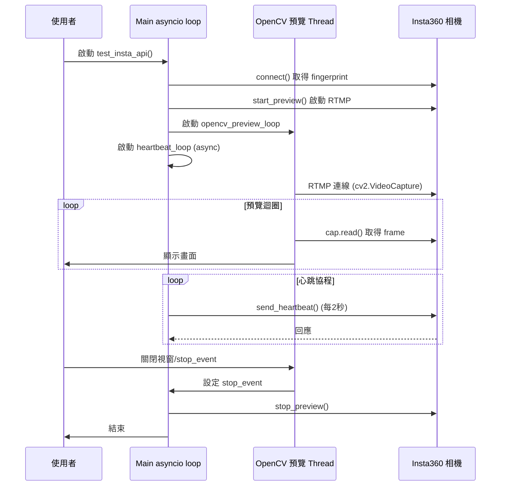

# Insta360 OpenCV 非同步預覽與心跳設計說明

## 背景與問題

在開發 Insta360 RTMP 串流即時預覽與控制時，常見需求是：
- 需要即時顯示相機畫面（高幀率預覽）。
- 同時維持與相機的 API 連線（如每秒心跳，避免 session 過期）。
- 兩者都要穩定、低延遲，且不互相干擾。

### 原本設計的問題

- OpenCV 的 `cv2.VideoCapture` 與 `cap.read()` 為同步阻塞操作，會卡住 Python 主執行緒。
- 即使在 async function 裡呼叫，event loop 仍會被阻塞，導致其他協程（如心跳）無法及時執行。
- Windows 平台的 asyncio event loop 對於高頻 socket 操作和同步 I/O 混用更敏感，容易出現 socket reset、event loop 崩潰等現象。
- RTMP 串流與 HTTP API（心跳）同時搶佔 socket 資源，若有一方阻塞，另一方也會受影響。

## 目前的檔案架構

```
insta_cam_module/
    非同步設計說明.md
    insta_api_test.py
    main.py
    README.md
    config/
        api_payloads.json
        settings.json
    controller/
        insta_controller.py
    services/
        heartbeat.py
    ui/
        main_window.py
    utils/
        config_loader.py
        frame_receiver.py
        frame_splitter.py
```

- **insta_api_test.py**：測試主流程，負責啟動 RTMP 預覽與心跳。
- **controller/insta_controller.py**：與 Insta360 API 溝通的主控類別。
- **services/heartbeat.py**：心跳服務邏輯。
- **utils/**：設定、frame 處理等輔助模組。

## 架構設計與解法

- **OpenCV RTMP frame 擷取完全移到 Thread 執行**，不再阻塞 asyncio event loop。
- **心跳 loop 保持在 asyncio 協程**，主 event loop 專心跑 async 任務。
- **UI frame 分割、resize、QPixmap 轉換全部移到 PyQt QThread**，主執行緒只 setPixmap。
- **所有 PyQt 物件與 QThread 必須在主執行緒建立與啟動，signal/slot 也要在主執行緒註冊**。
- **用 QTimer 輪詢 ready_event，避免阻塞主執行緒**。

## 訊號流與協作流程

1. 啟動主程式（asyncio）
2. 啟動 OpenCV 預覽 thread（同步 while 迴圈）
3. 啟動心跳 async 協程（每2秒發送一次）
4. 預覽 thread 偵測到結束（如視窗關閉、RTMP 中斷），設置 event
5. 心跳 loop 偵測到 event，結束
6. 主程式收尾，釋放資源

## Mermaid 訊號流程圖



## 2025/05 架構重構經驗補充

- UI frame 處理與 PyQt QThread 必須在主執行緒建立與啟動，否則訊號流會丟失。
- OpenCV 測試檔能正常顯示，UI 無畫面時，應優先檢查 QThread 啟動與 signal/slot 註冊時機。
- Windows 下 asyncio + OpenCV + RTMP 仍有 socket reset 問題，建議盡量減少同步 I/O 阻塞。

---

如需協助，請參考本說明與 README.md。
